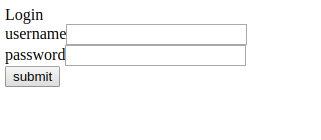
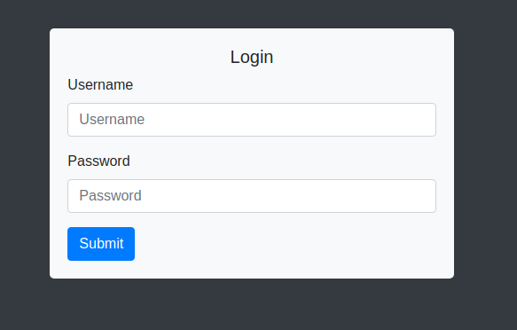

这是一个用来演示GitLab CI&CD的demo

## 背景知识
<<<<<<< HEAD
如果已经了解GitLab CI/CD，请直接跳到[Demo](#Demo)
=======
了解GitLab CI/CD直接跳到[Demo](#Demo)
>>>>>>> f750985fd514f0da9f5acd90e5944089aa45a900
### GitLab CI/CD

``GitLab``是一个远程仓库管理系统，和``GitHub``一样使用``Git``进行代码的版本控制管理。但是``GitLab``是开源的，可以利用``GitLab``搭建一个私有的代码仓库管理系统。([GitLab安装教程](https://about.gitlab.com/install))  
``GitLab``的CI/CD工具，主要利用本地代码向远程仓库推送的事件，来触发``CI/CD``的任务。

### 配置文件
那么``CI/CD``的任务具体是什么呢？每个项目的开发和生产环境都是不同的，其要求的集成和部署的任务也是不相同的。因此需要一个配置文件规定``CI/CD``的具体任务。

``GitLab``中使用配置文件``.gitlab-ci.yml``(YAML)，来规定``CI/CD``的具体任务。开发者只要在自己的项目文件 目录下定义该文件，代码上传到``GitLab``的远程仓库就可以触发``CI/CD``任务。  
该配置文件的样例如下：
``` yml
stages:             # 包含任务的所有阶段
  - build     
  - test
  - deploy

job-build:          # 任务名称
  stage: build      # 任务阶段
  script:
    - mvn compile   # maven 编译， 也可以是其他的编译命令

job-test:          # 任务名称
  stage: test      # 任务阶段
  script:
    - mvn test     # maven 测试， 也可以是其他的测试命令

job-deploy:          # 任务名称
  stage: deploy      # 任务阶段
  script:
    - mvn deploy    # maven 部署， 也可以是其他的部署命令
```

``stages``定义了集成测试会经历的几个阶段，总共分为``build``,``test``和 ``deploy``三个阶段。三个阶段的执行顺序是从左到右。


配置文件在项目中的位置如下：
``` yml
- project
  - .gitlab-ci.yml
```

#### 配置文件管理CI/CD优点
首先，``CI/CD``的配置采用文本文件的方式，便于对配置文件进行版本控制管理。  
其次，``.gitlab-ci.yml``作为项目代码的一部分，进行版本控制管理，可以明确每个代码版本对应的``CI/CD``任务。在需要对不同版本的软件进行集成和部署就十分方便。

### Pipelines和Jobs
``GitLab``触发``CI/CD``任务时，会将所有任务当做一个``Pipeline``，然后一个``Pipeline``内含有所有任务(``Jobs``)。

### Runner
前面说``GitLab``会触发``CI/CD``任务，那么``CI/CD``任务是在``GitLab``上执行的吗？
答案是否定的，因为``GitLab``本身是一个代码仓库的管理系统，如果``CI/CD``任务在``GitLab``服务器上执行势必会影响到代码管理系统的可用性。其次，不同项目``CI/CD``任务运行环境都是不同的，因此需要专门的机器或者虚拟环境来运行``CI/CD``任务。

``Runner``是替``GitLab``执行``CI/CD``任务的程序，并将运行结果反馈给``GitLab``。它被[安装](https://docs.gitlab.com/runner/install/linux-manually.html)在特定环境的机器上。(比如，测试环境需要Maven和Java，那么机器就需要配置两者的环境)


## Demo
本Demo是一个简单的web登录程序，该程序中包含两个可访问URL。  
1. Get /，返回登录表单页面
2. Post /login，处理登录逻辑    

同时对这两个请求进行了简单的单元测试，主要测试返回状态是否正常。
具体代码包含在分支``ci-1``中的``LoginController``和``LoginControllerTest``中。

为了便于操作，demo中含有6个分支，每个分支都是在上一个分支的基础上变更的。  

分支及其变更说明如下表

| 分支            | 变更                         |
| :------------- | :-------------               |
| master        | 项目初始化，仅含README.md        |
| ci-1          | 实现登录功能，配置.gitlab-ci.yml |
| ci-2-error    | 登录请求中引入异常               |
| ci-3-fix      | 修复登录请求中的异常              |
| cd-1          | 在.gitlab-ci.yml中加入部署配置  |
| cd-2          | 美化登录表单页面                |

首先，将仓库克隆到本地：  
``` shell
git clone https://github.com/melochin/ci-demo.git
```
其次，新建一个新的GitLab远程仓库，将它设置为本地仓库的远程仓库，将本地``master``分支推送到远程仓库。
```
git remote add origin {remote url}  
git push master:master
```

### CI  

#### ci-1  
该分支已经实现了登录的基本功能。为了实现持续集成，该分支已经加入了``.gitlab-ci.yml``配置文件。

``` yml
stages:
  - build
  - test

build:
  stage: build
  script:
    - mvn compile

test:
  stage: test
  script:
    - mvn test
```

添加``gitlab``的远程仓库地址，然后将``ci-1``推送到远程分支``dev``上。
``` bash
git push origin ci-1:dev                  # 将ci-1本地分支push到远程dev分支
```

``gitlab``收到``push``后，发现项目目录下含有``.gitlab-ci.yml``文件。``gitlab``首先检查配置文件的语法是否正确，如果正确，就让``runner``执行``.gitlab-ci.yml``中配置的任务。

在``runner``正常运行的情况下，本次集成的运行结果如下。通过结果可以看到提交的代码顺利通过了编译和单元测试。(如果没有可用的``runner``，需要进行[注册](https://docs.gitlab.com/runner/register/))

Pipelines  

  

Jobs  

  


#### ci-2-error  

该分支不不小心在登录处理的代码中引入了bug，引起了请求响应的异常。接着将将这段代码直接提交到``GitLab``上。

异常代码
LoginController.java
``` java
@PostMapping("/login")
public String check(@RequestParam("username") String username,
                    @RequestParam("password") String password) {
    throw new RuntimeException();
}
```

git提交指令  

``` bash
git push origin ci-2-error:dev         # 将ci-2-error本地分支push到远程dev分支
```

``GitLab``收到提交后，执行集成后的结果如下。  

Pipelines  

  

Jobs  


由于代码中引入的异常，被单元测试检测到了，因此测试任务失败了。这个红色的``failed``不仅可以告诉开发组的同事们，代码库中最新的代码是有问题的，不要``pull``下来，而且也在警告代码提交者要赶紧修复这个bug，否则最新的代码将无法部署到生产环境中。(当然这里更多是管理上的问题，如果管理层对集成出现的问题并不重视的话，做持续集成也是形同虚设。)

#### ci-3-fix  

将问题代码修复后，重新提交到``gitlab``，具体提交指令和执行结果如下。

``` bash
git push origin ci-3-fix:dev    # 将ci-3-fix本地分支push到远程dev分支
```


### CD

#### cd-1  

现在仓库中最新的代码都成功通过了单元测试。这给项目的开发人员和运维人员带来了很大的信心。现在要将程序部署到生产环境上。  

修改``.gitlab-ci.yml``，在配置中加入``deploy``任务。

```
stages:
  - build
  - test
  - deploy

build:
  ... #省略

test:
  ... #省略

deploy:
  stage: deploy
  script:
  - mvn package -B -Dmaven.test.skip=true
  - scp target/ci-demo-0.0.1-SNAPSHOT.jar kaze@10.10.26.157:~
  - scp deploy.sh kaze@10.10.26.157:~
  - ssh kaze@10.10.26.157 "chmod 700 ./deploy.sh; ./deploy.sh"
```

deploy.sh (启动web服务的脚本)
``` bash
#!/bin/bash --login
PID=$(sudo netstat -tnlp | grep 8080 |  awk '{print $7}' | grep '[0-9]\+' -o)
if [ "$PID" = "" ];then
    echo "port 8080 is free"
else
    echo "port 8080 is used and kill $PID"
    sudo kill -9 $PID
fi
echo "start server"
nohup java -jar ~/ci-demo-0.0.1-SNAPSHOT.jar >log.txt &
```


git提交命令  

``` bash
git push origin cd-1:master     # 将生产环境运行的版本上传到主分支
```

``GitLab``上的运行结果如下图所示。


编译、测试和部署任务正常执行完毕。输入网页的请求地址，发现网页已经部署成功。  
页面的显示结果如下图所示。  


#### cd-2  

上一版本的登录页面过于简单，客户觉得需要修改。因为上一版本通过了测试，再假设上一版本在生产环境运行的比较稳定，那么开发人员在开发新版本时，会有较大的信心，在新版本上引入较少的bug。而且如果出现问题，可以直接将新版本回退到稳定版本。

将修改后的页面``push``到``GitLab``
``` bash
git push origin cd-2:master  # 将生产环境运行的版本上传到主分支
```
刷新页面，网页更新成功。  


``CI``一定程序上确保了软件的质量，而``CD``则降低了人工部署引入的问题的可能性。两者给开发人员和运维人员都带来了很大的信心，这种信心能够极大缩小软件部署周期，能够让客户及时反馈软件的不足。


#### 版本回退  

现在客户又想了下，觉得还是以前的页面比较好，要求回退版本。

在``GitLab``找到老版本执行的部署任务，点下右边的按钮(retry)，然后就会运行部署脚本。


首先，生产环境的代码都集中在master分支，可以轻易的找到要部署的版本，不会搞错版本。(因此上文中涉及到部署的版本，都上传到了master分支)  
其次，上一版本通过了测试且在生产环境跑过一段时间了。因此在进行部署时，会有很大的信心，版本回退不会出现太大的问题。

## 总结  

``GitLab``的``CI/CD``工具，其主要功能包含``gitlab``对提交到远程仓库代码的``CI/CD``的触发、对执行``CI/CD``任务的``runner``调度管理、对执行``CI/CD``脚本的版本控制管理。但是具体``CI/CD``的执行脚本命令需要开发人员编写，因此想要实现``CI/CD``需要了解脚本语言。同时``CI/CD``执行的命令不局限于编译、测试、部署，还可以是代码质量检测、API文档生成等。完全取决于开发人员想要脚本替他们做什么。

想对``GitLab CI/CD``更多了解的，请见[GitLab Continuous Integration (GitLab CI/CD)
](https://docs.gitlab.com/ee/ci/README.html)  
想了解更多的CI/CD的知识，推荐阅读《持续集成：软件质量改进和风险降低之道》
